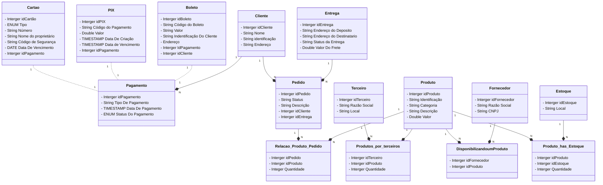

# Modelagem do Diagrama De Entidade-Relacionamento de um E-commerce

### Entidades
 - Cliente
 - Pagamento
 - Cartão
 - PIX
 - Boleto
 - Pedido
 - Entrega
 - Relação de Produto/Pedido
 - Produto
 - Produto por Vedendor(Terceiro)
 - Terceiro - Vedendor
 - Produto_has_Estoque
 - Disponibilizando um Produto
 - Estoque
 - Fornecedor
 - Pessoa Fisica
 - Pessoa Juridica

### Diagrma Do E-Commerce v1 (Versão 1)

---

### Diagrma Do E-commerce Refinado

```mermaid
classDiagram
    class Cliente {
        - Interger idCliente
        - String Endereço
    }

    class Pessoa Fisica {
        - Interger idPessoaFisica
        - String Nome
        - DATE Data De Nascimento
        - String CPF
        - Interger idCliente
    }

    class Pessoa Juridica {
        - Interger idPessoaJuridica
        - String Razão Social
        - DATE Data De Abertura
        - String CNPJ
        - String Inscrição Estadual
        - Interger idCliente
    }

    class Pagamento {
        - Interger idPagamento
        - ENUM Tipo De Pagamento
        - TIMESTAMP Data De Pagamento
        - ENUM Status Do Pagamento
        - Interger IdCliente
    }

    class Cartao {
        - Interger idCartão
        - ENUM Tipo Do Cartão
        - String Número
        - String Nome do proprietário
        - String Código de Segurança
        - DATE Data De Vencimento
        - Interger idPagamento
    }

    class PIX {
        - Interger idPIX
        - String Código do Pagamento
        - Double Valor
        - TIMESTAMP Data De Criação
        - TIMESTAMP Data de Vencimento 
        - Interger idPagamento
    }

    class Boleto {
        - Interger idBoleto
        - String Código do Boleto
        - String Valor
        - String Indentificação Do Cliente
        - Endereço
        - Interger IdPagamento
    }

    class Pedido {
        - Interger idPedido
        - String Status
        - String Descrição
        - Interger idCliente
        - Interger idEntrega
    }

    class Entrega {
        - Interger idEntrega
        - String Endereço do Deposito
        - String Endereço do Destinatario
        - String Status da Entrega
        - Double Valor Do Frete
        - String Código De Rastreamento
    }

    class Relacao_Produto_Pedido {
        - Interger idPedido
        - Interger idProduto
        - Integer Quantidade
    }

    class Produto {
        - Interger idProduto
        - String Identificação
        - String Categoria
        - String Descrição
        - Double Valor
    }    

    class Terceiro {
        - Interger idTerceiro
        - String Razão Social
        - String Local
    }

    class Produtos_por_terceiros {
        - Interger idTerceiro
        - Interger idProduto
        - Interger Quantidade
    }

    class Disponibilizando um Produto {
        - Interger idFornecedor
        - Interger idProduto
    }

    class Produto_has_Estoque {
        - Interger idProduto
        - Interger idEstoque
        - Interger Quantidade
    }

    class Fornecedor {
        - Interger idFornecedor
        - String Razão Social
        - String CNPJ
    }

    class Estoque {
        - Interger idEstoque
        - String Local
    }

    Cartao "1" .. "1" Pagamento
    PIX "1" .. "1" Pagamento
    Boleto "1" .. "1" Pagamento
    Cliente "1" .. "1" Pessoa Fisica
    Cliente "1" .. "1" Pessoa Juridica
    Cliente "1" --* "N" Pagamento
    Cliente "1" --* "N" Pedido
    Entrega "1" --* "N" Pedido
    Pedido "1" --* "N" Relacao_Produto_Pedido
    Terceiro "1" --* "N" Produtos_por_terceiros
    Produto "1" --* "N" Relacao_Produto_Pedido
    Produto "1" --* "N" Produtos_por_terceiros
    Produto "1" --* "N" Disponibilizando um Produto
    Produto "1" --* "N" Produto_has_Estoque
    Fornecedor "1" --* "N" Disponibilizando um Produto
    Estoque "1" --* "N" Produto_has_Estoque
```
