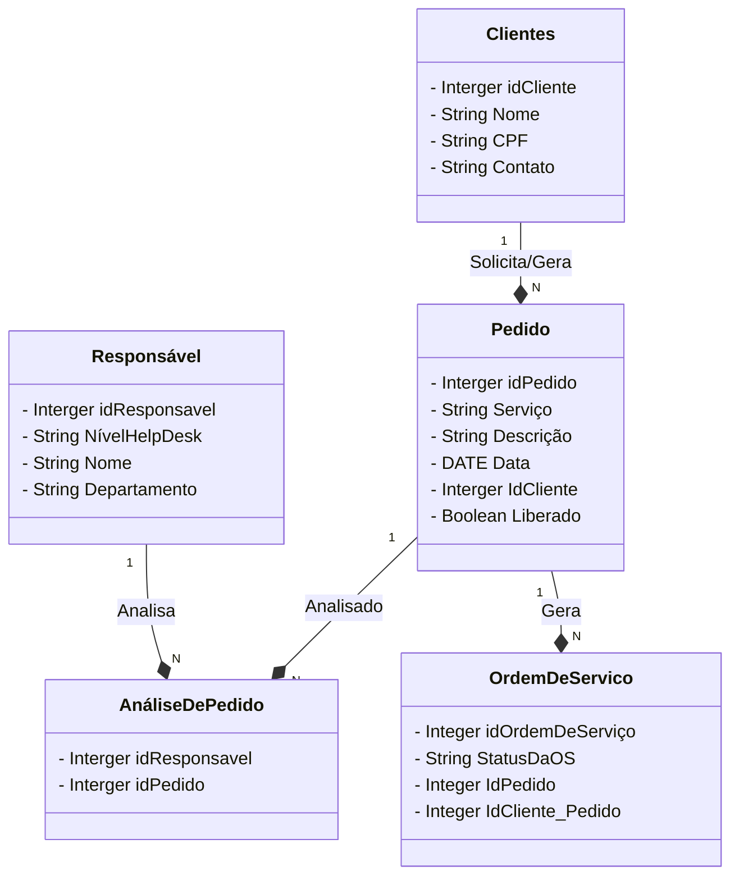

# Diagrama De Modelagem de Criação De OS

### Entidades
 - Clientes
 - Pedido
 - Responsável
 - Análise De Pedido
 - Pedido
 - Ordem De Serviço

## Diagrama

```mermaid
classDiagram
    class Clientes {
        - Interger idCliente
        - String Nome
        - String CPF
        - String Contato
    }
    
    class Pedido {
        - Interger idPedido
        - String Serviço
        - String Descrição
        - DATE Data
        - Interger IdCliente
        - Boolean Liberado
    }

    class Responsável {
        - Interger idResponsavel
        - String NívelHelpDesk
        - String Nome
        - String Departamento
    }

    class Análise De Pedido {
        - Interger idResponsavel
        - Interger idPedido
    }

    class Ordem De Servico {
        - Integer idOrdemDeServiço
        - String StatusDaOS
        - Integer IdPedido
        - Integer IdCliente_Pedido
    }

    Clientes "1" --* "N" Pedido : Solicita/Gera
    Pedido "1" --* "N" Análise De Pedido : Analisado
    Responsável "1" --* "N" Análise De Pedido : Analisa
    Pedido "1" --* "N" Ordem De Servico : Gera

```