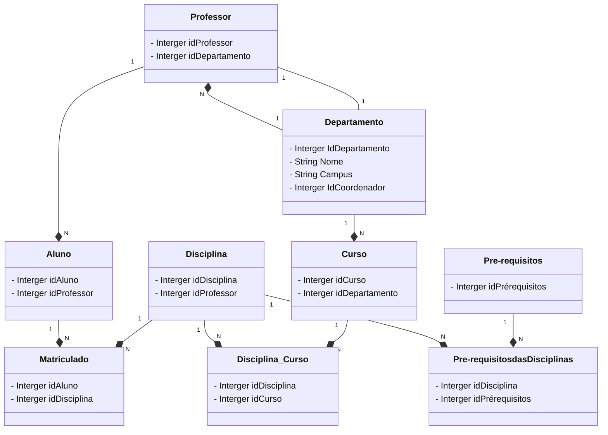
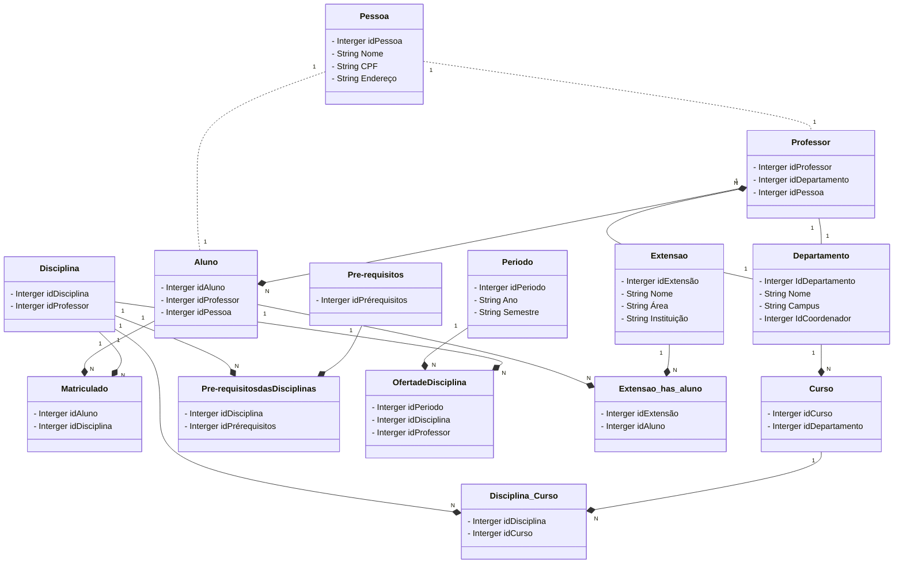

# Diagrama De Modelagem de Universidade

### Entidades
 - Disciplina
 - Professor
 - Pré-requisitos Das Disciplinas
 - Pré-Requisitos
 - Matriculado
 - Aluno
 - Departamento
 - Curso
 - Disciplina & Curso

### Diagrma Da Universidade v1 (Versão 1)

---

### Diagrma Da Universidade Refinado
